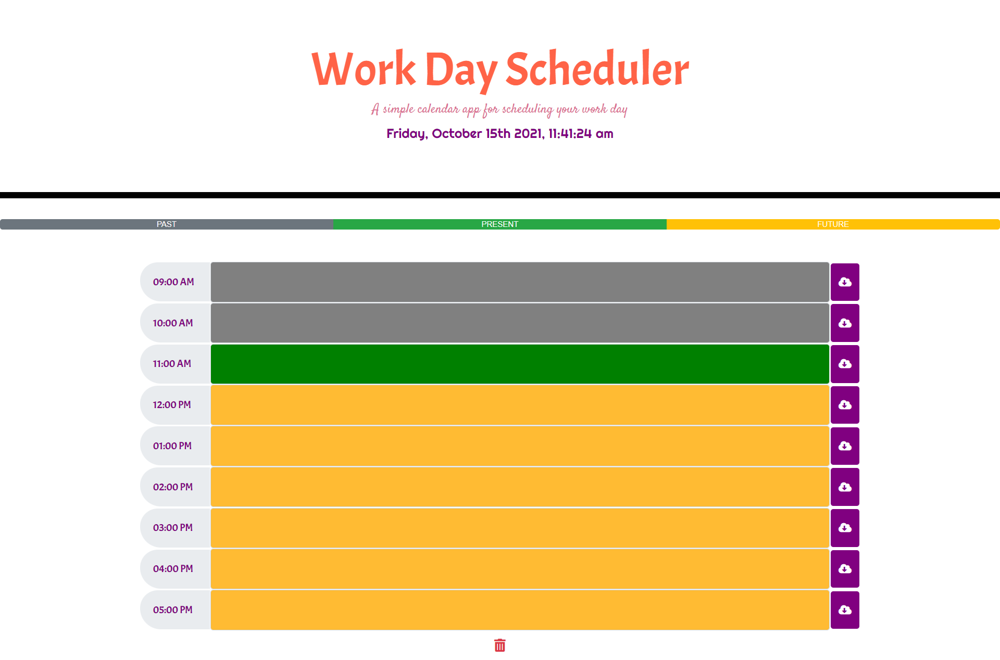
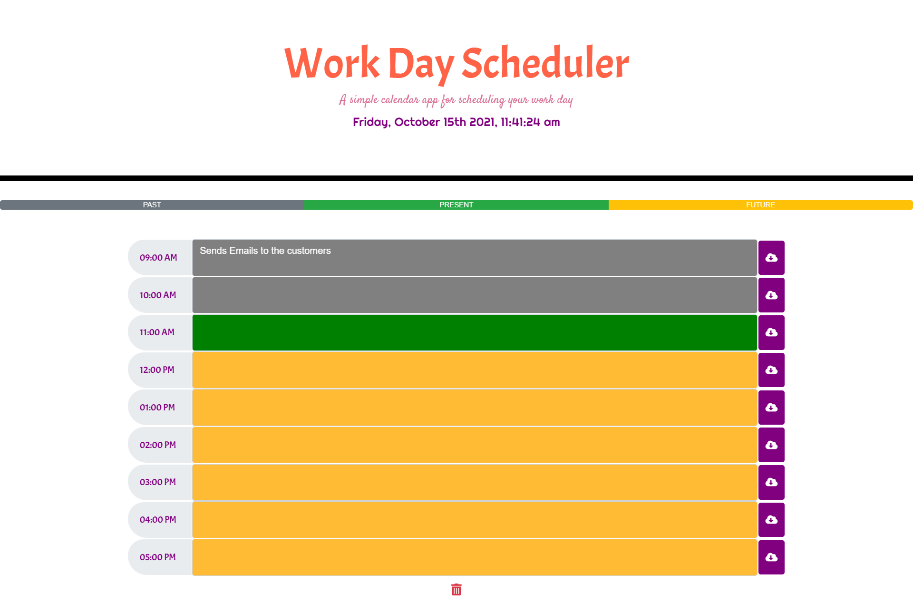
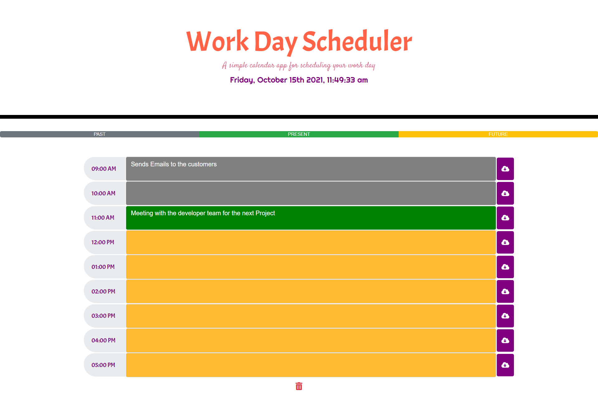
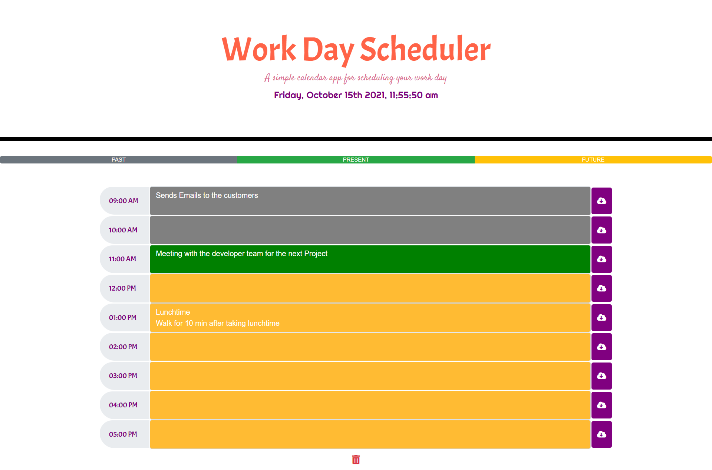
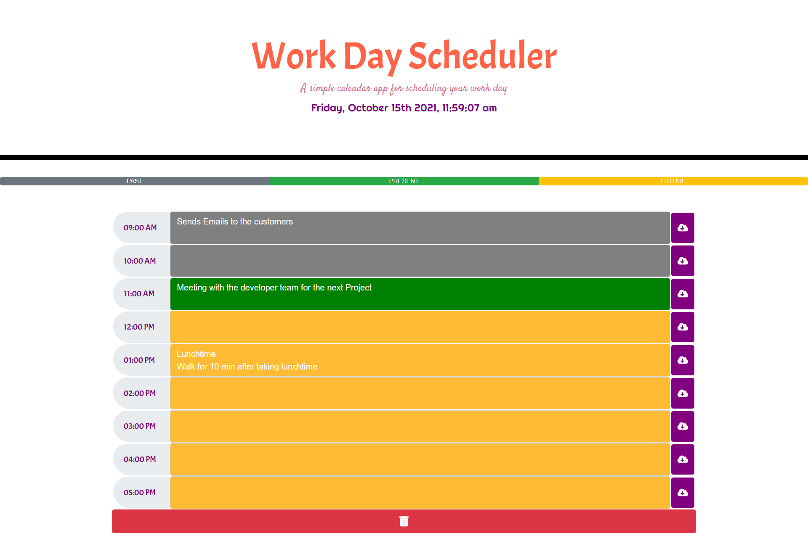

# Day-Scheduler

Creation of a repository in GitHub:

  * Name of repository:Day Scheduler
  * Using GitBash to create Directories and files.

# Starting to Apply the Acceptance Criteria.

 * The planner interface presented with the current day on the top (header) and  a timeblocks for standard business hours after;
 * Each timeblock of the current day is color coded to indicate whether it is in the past (gray), present (green), or future (yellow);
 * Posssibility to write event and save them into the locale storage;
 * Although the refresh of the web page the saved events persist.

# Extra developing code :

* Add a progress bar to display times color [ the past (gray), present (green), or future (yellow)];
* Add a button block that delete the saved events which have the same key into the locale Storage that allows the user to free all the saved events insted of delete one by one;
* Add Alert Messages.
* Possibility of unlock and lock past Events
   

# GitBash & GitHub:

* Commit with msg every modification in code.
* Pushing to the repository in GitHub. 

# Application's Screenshots :

* The planner interface :

* Adding Events :

* Delete all events :

# Links :

* The URL of the deployed application: https://meryem-ad.github.io/Day-Scheduler/Develop/index.html
* The URL of the GitHub repository: https://github.com/MERYEM-AD/Day-Scheduler
